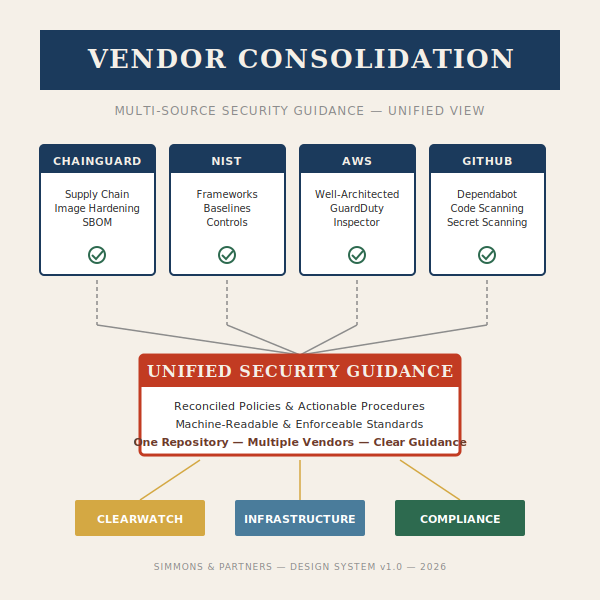
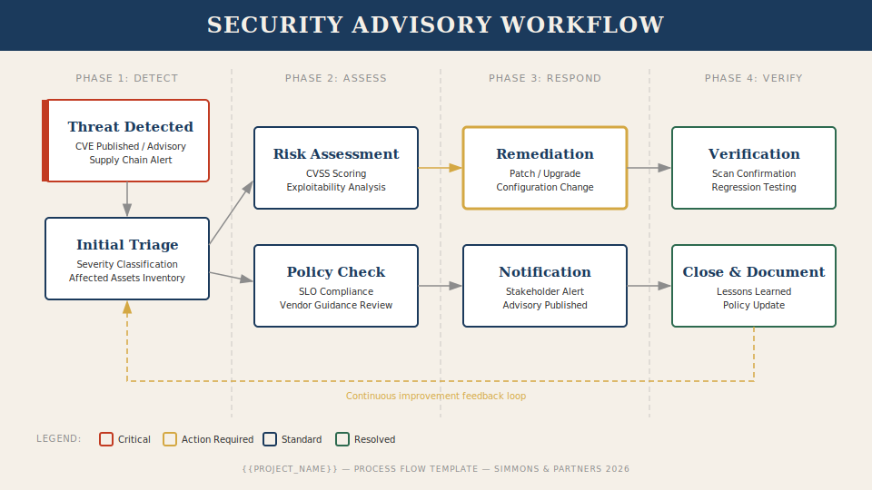

# Design System — Madison Avenue, 1958

> **The Simmons & Partners Visual Identity Manual**
> Established for cross-project consistency. All designers reference this document as source of truth.

**STATUS:** Active
**Version:** 1.0.0
**Last Updated:** 2026-03-25

---

## 1. Design Philosophy

We draw from the golden age of American advertising — the era when Sterling Cooper ruled Madison Avenue. Every visual asset should feel like it was designed by a senior art director in 1958: confident, sophisticated, and purposeful.

**Core Principles:**
- **Authority** — Bold, assured compositions that command attention
- **Clarity** — Information hierarchy is immediate and unambiguous
- **Restraint** — Elegant negative space; never cluttered
- **Warmth** — Rich, saturated mid-century tones; never cold or sterile
- **Craft** — Every element placed with intention, nothing accidental

---

## 2. Color Palette

Colors sourced from Pantone references common in 1950s-1960s print advertising. Each color has a role.

### Primary Palette

| Swatch | Name              | Hex       | Pantone Ref     | Role                          |
|--------|-------------------|-----------|-----------------|-------------------------------|
| 🔴     | Executive Red     | `#C23B22` | Pantone 7620 C  | Alerts, critical, CTAs        |
| 🔵     | Sterling Navy     | `#1B3A5C` | Pantone 289 C   | Primary text, headers, frames |
| ⚪     | Ivory Linen       | `#F5F0E8` | Pantone 7527 C  | Backgrounds, paper texture    |
| 🟤     | Mahogany          | `#6B3A2A` | Pantone 4695 C  | Accents, warm details         |

### Secondary Palette

| Swatch | Name              | Hex       | Pantone Ref     | Role                          |
|--------|-------------------|-----------|-----------------|-------------------------------|
| 🟡     | Bourbon Gold      | `#D4A843` | Pantone 7405 C  | Highlights, badges, success   |
| 🟢     | Club Green        | `#2D6A4F` | Pantone 7734 C  | Positive status, compliance   |
| ⚫     | Charcoal Ink      | `#2B2B2B` | Pantone Black 7 | Body text, fine detail        |
| 🔘     | Smoke Gray        | `#8C8C8C` | Pantone 423 C   | Muted text, dividers, borders |

### Functional Palette

| Swatch | Name              | Hex       | Role                          |
|--------|-------------------|-----------|-------------------------------|
| 🔴     | Alert Red         | `#C23B22` | Critical severity, errors     |
| 🟠     | Caution Amber     | `#D4842A` | Warnings, medium severity     |
| 🟡     | Advisory Gold     | `#D4A843` | Low severity, informational   |
| 🟢     | Compliant Green   | `#2D6A4F` | Pass, healthy, compliant      |
| 🔵     | Neutral Blue      | `#4A7C9B` | Informational, in-progress    |

### Dark Mode Adaptation

For dark backgrounds (`#1A1A2E` or `#2B2B2B`):
- Ivory Linen → use as text color at 90% opacity
- Sterling Navy → lighten to `#4A7C9B` (Neutral Blue)
- Executive Red → remains `#C23B22` (high contrast on dark)
- Bourbon Gold → remains `#D4A843`
- Backgrounds use `#1A1A2E` (Pantone 5395 C)

---

## 3. Typography

Mid-century advertising relied on high-contrast type pairings: a commanding display face and a clean workhorse for body copy.

### Font Stack

| Role        | Font Family                    | Weight       | Size (SVG)   | Size (Web)    |
|-------------|--------------------------------|--------------|--------------|---------------|
| Display     | **Playfair Display**           | 700 (Bold)   | 36-48px      | 2.5-3rem      |
| Subheading  | **Playfair Display**           | 600 (Semi)   | 24-30px      | 1.5-1.875rem  |
| Body        | **Source Sans 3**              | 400 (Regular)| 14-16px      | 0.875-1rem    |
| Body Bold   | **Source Sans 3**              | 600 (Semi)   | 14-16px      | 0.875-1rem    |
| Monospace   | **Source Code Pro**            | 400 (Regular)| 13-14px      | 0.8125-0.875rem|
| Caption     | **Source Sans 3**              | 400 (Regular)| 11-12px      | 0.6875-0.75rem|

All fonts available on Google Fonts. Fallback stack: `Georgia, "Times New Roman", serif` for display; `"Helvetica Neue", Arial, sans-serif` for body.

### Type Hierarchy Rules

1. **Headlines** — All caps or title case. Letter-spacing: +0.05em for all caps.
2. **Subheads** — Title case only. Never all caps on subheads.
3. **Body** — Sentence case. Line-height: 1.5 for readability.
4. **Labels/Captions** — All caps, letter-spacing +0.08em, Smoke Gray color.
5. **Maximum two font families per composition.** Never three.

---

## 4. SVG Standards

### Canvas Dimensions

| Asset Type          | viewBox            | Aspect Ratio | Notes                        |
|---------------------|--------------------|--------------|------------------------------|
| Diagram (wide)      | `0 0 960 540`      | 16:9         | Process flows, architectures |
| Diagram (square)    | `0 0 600 600`      | 1:1          | Consolidation, comparison    |
| Icon                | `0 0 64 64`        | 1:1          | Security concept icons       |
| Hero/Header         | `0 0 1200 400`     | 3:1          | README banners               |
| Badge               | `0 0 200 40`       | 5:1          | Status badges                |

### Stroke & Line Standards

| Element             | Stroke Width | Color             | Notes                        |
|---------------------|--------------|-------------------|------------------------------|
| Primary borders     | 2px          | Sterling Navy     | Boxes, frames                |
| Connection lines    | 1.5px        | Smoke Gray        | Flow arrows, links           |
| Emphasis borders    | 3px          | Executive Red     | Alert boxes, critical items  |
| Dividers            | 1px          | Smoke Gray @ 40%  | Subtle separators            |
| Icon strokes        | 2px          | Sterling Navy     | Consistent icon weight       |

### Shadow & Depth

Mid-century print used subtle shadows to create depth without photorealism.

```
/* Standard card shadow */
filter: drop-shadow(3px 3px 0px rgba(43, 43, 43, 0.15))

/* Elevated element (hero, featured) */
filter: drop-shadow(5px 5px 0px rgba(43, 43, 43, 0.2))

/* No shadow — flat elements */
Labels, dividers, background shapes
```

In SVG, implement as:
```xml
<defs>
  <filter id="shadow-standard" x="-5%" y="-5%" width="115%" height="115%">
    <feDropShadow dx="3" dy="3" stdDeviation="0" flood-color="#2B2B2B" flood-opacity="0.15"/>
  </filter>
  <filter id="shadow-elevated" x="-5%" y="-5%" width="115%" height="115%">
    <feDropShadow dx="5" dy="5" stdDeviation="0" flood-color="#2B2B2B" flood-opacity="0.2"/>
  </filter>
</defs>
```

Hard-edge shadows (stdDeviation="0") are period-accurate. Soft/blurred shadows feel modern — avoid them.

### Corner Radius

| Element         | Radius | Notes                              |
|-----------------|--------|------------------------------------|
| Cards/Boxes     | 4px    | Subtle, professional               |
| Buttons/Badges  | 2px    | Tight, typographic feel            |
| Icons           | 0px    | Sharp, authoritative               |
| Containers      | 0px    | Full-bleed, print-inspired         |

---

## 5. Icon Design System

Icons follow a **single-weight line style** at 2px stroke, 64x64 viewBox, Sterling Navy default color.

### Design Rules

1. **Grid**: 64x64 with 4px padding (safe area: 56x56 centered)
2. **Stroke only** — no fills except for status indicators
3. **Geometric construction** — circles, rectangles, 45-degree angles
4. **Consistent metaphors** across all projects:

| Concept         | Icon Metaphor              | Notes                          |
|-----------------|----------------------------|--------------------------------|
| Threat          | Shield with exclamation    | Universal danger signal        |
| Compliance      | Checkmark in circle        | Approval, certification        |
| Automation      | Interlocking gears         | Process, machinery             |
| Vulnerability   | Cracked shield             | Breach, weakness               |
| Monitoring      | Eye / radar sweep          | Observation, surveillance      |
| Policy          | Document with seal         | Authority, governance          |
| Vendor          | Building / storefront      | Organization, external entity  |
| Integration     | Puzzle pieces connecting   | Assembly, compatibility        |
| Performance     | Speedometer gauge          | Metrics, speed                 |
| Lock/Security   | Padlock                    | Access control, encryption     |

---

## 6. Composition Rules

### Layout Grid

All diagrams use a **12-column grid** within the viewBox. For a 960-wide canvas:
- Column width: 60px
- Gutter: 20px
- Margins: 40px left/right

### Golden Ratio Spacing

Use the golden ratio (1.618) for vertical rhythm:
- Base unit: 16px
- Spacing scale: 16, 26, 42, 68, 110px

### Visual Hierarchy (Z-Pattern)

For informational diagrams, arrange elements in Z-pattern reading flow:
1. **Top-left**: Title / most important element
2. **Top-right**: Status / summary badge
3. **Center**: Main content / diagram body
4. **Bottom-left**: Legend / key
5. **Bottom-right**: Source attribution / date

### Balance & Weight

- **Asymmetric balance preferred** — more dynamic than centered layouts
- Heavy elements (dark, large) toward bottom-left; light elements top-right
- Never center-align everything — it reads as timid. Left-align body, center only display titles

### Negative Space

- Minimum 20% of canvas should be empty space
- Group related elements; separate groups with generous whitespace
- When in doubt, add more space — never less

---

## 7. Patterns & Textures

### Background Treatments

1. **Clean Ivory** — `#F5F0E8` solid. Default for most compositions.
2. **Linen Texture** — Subtle crosshatch pattern at 3% opacity over Ivory. For premium/hero assets.
3. **Navy Field** — `#1B3A5C` solid with Ivory text. For headers and callout boxes.
4. **Gradient Wash** — Ivory to white (`#F5F0E8` → `#FFFFFF`), top to bottom. For long-form diagrams.

### Border Treatments

1. **Single Rule** — 2px Sterling Navy. Standard box treatment.
2. **Double Rule** — 2px + 1px Sterling Navy, 3px gap. Premium/header treatment.
3. **Accent Stripe** — 4px left border in Executive Red or Bourbon Gold. For callout/alert boxes.

---

## 8. Template Library

All templates stored in `design-system/` directory:

| File                           | Type              | Purpose                              |
|--------------------------------|-------------------|--------------------------------------|
| `vendor-consolidation.svg`     | Diagram (square)  | Multi-vendor comparison/flow         |
| `process-flow.svg`             | Diagram (wide)    | Sequential process visualization     |
| `security-icons.svg`           | Icon sheet        | Complete security icon set           |
| `hero-header.svg`              | Hero (wide)       | README banner template               |
| `status-dashboard.svg`         | Diagram (wide)    | Multi-metric status overview         |

---

## 9. Implementation Guide

### Embedding SVGs in Markdown

```markdown
<!-- Inline SVG (GitHub renders these) -->


<!-- With link -->
[](link-to-detail)
```

### Adapting Templates

1. **Clone the template** — never modify originals
2. **Replace placeholder text** — marked with `{{PLACEHOLDER}}` in templates
3. **Swap palette** — for project-specific color, only change secondary colors. Primary palette stays fixed.
4. **Scale** — use viewBox, never change internal dimensions. Let the browser/renderer scale.

### Project Color Variations

Each project may define ONE accent color to supplement the shared palette:

| Project        | Accent Color   | Hex       | Use For                    |
|----------------|----------------|-----------|----------------------------|
| Advice         | Bourbon Gold   | `#D4A843` | Guidance highlights        |
| Clearwatch     | Club Green     | `#2D6A4F` | Compliance/health status   |
| Infrastructure | Neutral Blue   | `#4A7C9B` | System/network elements    |
| Generals       | Executive Red  | `#C23B22` | Command/authority emphasis |

### Responsive Sizing

SVGs are inherently scalable. For Markdown contexts:
- Set `width="100%"` on the SVG element
- viewBox handles internal proportions
- Minimum readable size: 400px wide for diagrams, 32px for icons
- Test at 50% zoom to ensure text remains legible

### Dark Mode

GitHub automatically applies dark mode. To support it:
```xml
<style>
  @media (prefers-color-scheme: dark) {
    .bg-ivory { fill: #1A1A2E; }
    .text-navy { fill: #F5F0E8; }
    .text-charcoal { fill: #E0E0E0; }
    .border-navy { stroke: #4A7C9B; }
  }
</style>
```

---

## 10. Design Decisions & Rationale

| Decision                     | Rationale                                                                 |
|------------------------------|---------------------------------------------------------------------------|
| Hard-edge shadows            | Period-accurate to 1950s print. Soft shadows read as modern/digital.     |
| Playfair Display             | Closest Google Font to mid-century display type (Didone classification). |
| Source Sans 3 for body       | Clean, highly legible sans-serif. Period-appropriate (Swiss style was emerging in the late 1950s). |
| No gradients in fills        | Flat color with shadow depth. Gradients only for subtle background wash. |
| 4px corner radius max        | Sharp corners = authority. Round corners = friendly/modern. We want authority. |
| Left-aligned body text       | Period standard. Center alignment was reserved for headlines only.        |
| All caps for labels          | Advertising convention for category labels and section dividers.         |
| Asymmetric layouts           | More dynamic and confident than symmetric. Mirrors magazine ad layouts.  |
| Limited palette (8 colors)   | Discipline. Real ads used 2-4 colors due to print costs. 8 is generous. |
| 2px consistent stroke weight | Unified visual weight across all elements. Prevents visual noise.        |

---

*"Make it simple, but significant."* — Don Draper
